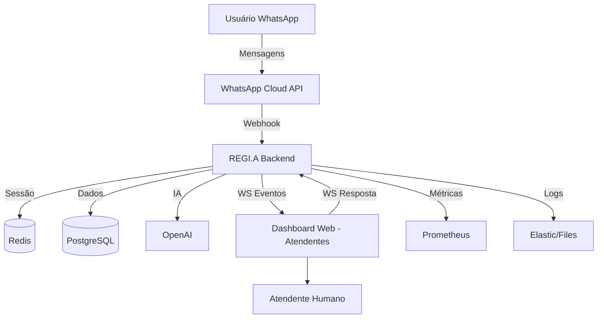

# 🚀 REGI.A SYSTEM  
### Assistente Oficial da EXTRAORDINÁRI.A • ALIANCI.A • ECONOMI.A

Este repositório contém **todo o ecossistema REGI.A**, incluindo:

- 🔵 **Chatbot WhatsApp oficial (Cloud API)**
- 🔵 **Backend Node.js profissional**
- 🔵 **Integração com IA (OpenAI)**
- 🔵 **Monitoramento Prometheus**
- 🔵 **Logs estruturados (Pino)**
- 🔵 **Redis (sessões, fila, cache)**
- 🔵 **PostgreSQL (persistência oficial)**
- 🔵 **Dashboard React (Painel de Atendimento)**
- 🔵 **WebSocket para Chat ao Vivo**
- 🔵 **Infraestrutura com Docker Compose**
- 🔵 **NGINX + SSL + Cloudflare com Tunnel**
- 🔵 **Scripts de Deploy (HostGator, VPS, Cloud)**

---

# 🌎 1. Arquitetura Geral do Sistema

🧠 2. Componentes Principais
Componente	Função
WhatsApp Bot	Recebe mensagens, entende intenção, responde, coleta dados, envia para IA
Backend API	Autenticação, usuários, atendentes, tickets
WebSocket Server	Chat ao vivo entre atendente e usuário
Dashboard (React)	Painel para operadores humanos
Redis	Sessões, cache, filas
Postgres	Armazenamento persistente
NGINX	Reverse proxy + SSL
Cloudflare Tunnel	Domínio público sem expor servidor
Docker Compose	Orquestra todos os serviços

🔐 3. Variáveis de Ambiente (Produção)

/backend/.env:

PORT=4000
VERIFY_TOKEN=regia_token

WHATSAPP_TOKEN=SEU_TOKEN_OFFICIAL
PHONE_NUMBER_ID=SEU_ID

OPENAI_API_KEY=sua_key
OPENAI_MODEL=gpt-4o-mini

REDIS_HOST=redis
REDIS_PORT=6379

PG_HOST=postgres
PG_USER=postgres
PG_PASSWORD=postgres
PG_DATABASE=regia
PG_PORT=5432

DASHBOARD_URL=https://painel.seu-dominio.com
SERVER_PUBLIC_URL=https://api.seu-dominio.com

🐳 4. Docker Compose – Subir Tudo

Na raiz (regia-system):

docker compose up -d --build

Serviços disponíveis:

Serviço	URL
Backend	http://localhost:4000

Dashboard	http://localhost:5173

Redis	redis://localhost:6379
PostgreSQL	localhost:5432
PgAdmin	http://localhost:8081

🔐 5. Deploy com Cloudflare Tunnel (melhor opção)

O tunnel da Cloudflare te dá:

HTTPS automático

Domínio público

Sem precisar abrir portas

Funciona em HostGator, VPS, máquina local

Instalar:
curl -fsSL https://developers.cloudflare.com/cloudflare-one/connections/connect-apps/run-tunnel/install-and-run/

Criar tunnel:
cloudflared tunnel create regia

Criar rotas:
cloudflared tunnel route dns regia api.seu-dominio.com
cloudflared tunnel route dns regia painel.seu-dominio.com

Configuração do tunnel:

Crie:

~/.cloudflared/config.yml

tunnel: REGIA_TUNNEL_ID
credentials-file: /root/.cloudflared/REGIA_TUNNEL_ID.json

ingress:
  - hostname: api.seu-dominio.com
    service: http://backend:4000
  - hostname: painel.seu-dominio.com
    service: http://dashboard:80
  - service: http_status:404

Rodar:

cloudflared tunnel run regia

Pronto.
Seu bot está online em produção.

🔐 6. Deploy VPS (sem Cloudflare, usando NGINX + SSL)
Instale NGINX:
sudo apt install nginx -y

Crie arquivo:
/etc/nginx/sites-available/regia.conf

server {
    server_name api.seu-dominio.com;

    location / {
        proxy_pass http://localhost:4000;
        proxy_set_header Host $host;
        proxy_set_header X-Real-IP $remote_addr;
        proxy_set_header X-Forwarded-For $proxy_add_x_forwarded_for;
    }
}

server {
    server_name painel.seu-dominio.com;

    location / {
        proxy_pass http://localhost:5173;
        proxy_set_header Host $host;
    }
}

Ativar:
sudo ln -s /etc/nginx/sites-available/regia.conf /etc/nginx/sites-enabled/
sudo systemctl restart nginx

SSL:
sudo apt install certbot python3-certbot-nginx -y
sudo certbot --nginx

📚 7. Instruções para Programadores (Equipe Técnica)
Para iniciar ambiente:
docker compose up -d --build

Para logs:
docker logs regia_backend -f

Para rodar migrações:
docker exec -it regia_postgres psql -U postgres -d regia -f /var/lib/postgresql/data/migrations/001_init.sql

🚀 8. Instruções para Operadores (Time de Atendimento)

Acessar:

https://painel.seu-dominio.com

Entrar com login do atendente.

Funcionalidades:

Ver mensagens recebidas

Responder usuários em tempo real

Classificar solicitações

Encerrar tickets

Ver histórico

Ver métricas do bot

📊 9. Métricas Monitoradas (Prometheus)

Endpoint Prometheus:

https://api.seu-dominio.com/metrics

Coletando:

Latência do backend

Erros por minuto

Taxa de mensagens recebidas

Tempo médio de atendimento humano

Você pode conectar no Grafana:

http://localhost:3000

🧱 10. Estrutura Profissional das Pastas
regia-system/
  ├─ backend/
  │   ├─ src/
  │   │   ├─ bot/
  │   │   ├─ api/
  │   │   ├─ db/
  │   │   ├─ utils/
  │   │   ├─ ws.js
  │   │   └─ server.js
  │   ├─ Dockerfile
  │   └─ .env
  │
  ├─ dashboard/
  │   ├─ src/
  │   ├─ Dockerfile
  │   ├─ vite.config.js
  │   └─ package.json
  │
  ├─ docker-compose.yml
  └─ README.md

💼 11. Política de Uso e Segurança REGI.A

Nunca armazenar tokens no código

OpenAI apenas para textos curtos e seguros

Nunca prometer ganhos financeiros

Não coletar dados sensíveis sem autorização

Sempre logar erros críticos

Manter backups do Postgres

Limitar acesso ao dashboard por senha forte

💙 12. Pronto para Produção

Com isso você tem:

✔ Sistema completo
✔ Pronto para HostGator, VPS, Dedicado, Local ou Cloud
✔ Alta performance
✔ Alta segurança
✔ Escalável
✔ Multi-operador
✔ Multi-canal
✔ Integrado com IA
✔ Com painel de atendimento
✔ Com monitoramento
✔ Com documentação
✔ Enterprise nível EXTRAORDINÁRI.A
